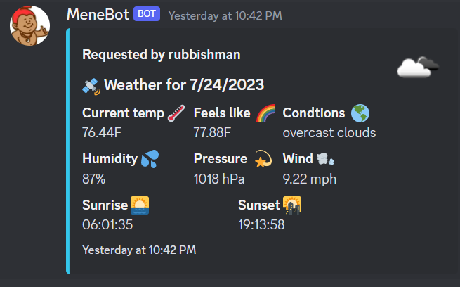
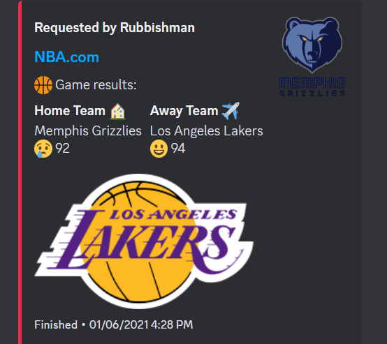

# Discord Bot

This is a simple Discord bot that I did for my friend's Discord server. It can tell jokes, get the current weather, get the weather forecast, get NBA scores by date, etc.

### Here's a picture of what the bot returns





## Project setup

```
npm install
```

Please rename the ".env-example" file to ".env" and enter your own RapidAPI key, Open Weather API key, and your Discord token.

### Compiles and hot-reloads for development

```
nodemon bot.js
```

## Built With

- [Discord.js](https://discord.js.org/#/)
- [OpenWeather API](https://openweathermap.org/guide)
- [Rakuten Rapid API](https://english.api.rakuten.net/)

## Contributing

Pull requests are welcome. For major changes, please open an issue first to discuss what you would like to change.

## License

[MIT](https://choosealicense.com/licenses/mit/)

## Author

Garrett Chun - [![Github][1.1]][1] [![Twitter][1.2]][2]

[1.1]: http://i.imgur.com/9I6NRUm.png
[1.2]: ./src/twitter20.png
[1]: https://github.com/KapakahiCoder
[2]: http://www.twitter.com/KapakahiCoder
